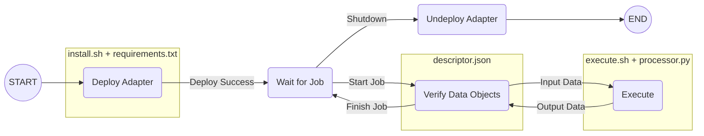

# Simulation-as-a-Service (SaaS) Middleware

The SaaS Middleware provides the necessary infrastructure to facilitate deployment and operations
of a loosely-coupled federation of models.

## Install
### Prerequisites
- Python 3.10 _(does not work on 3.11 as of now)_

Clone this repository and install it using pip:
```shell
git clone https://github.com/sec-digital-twin-lab/saas-middleware
pip install ./saas-middleware

# install in dev mode
pip install "./saas-middleware[dev]"
```

## Usage
The SaaS Middleware can be used via a Command Line Interface (CLI) with this command once it is installed:
```shell
saas-cli
```

The CLI can be used in a 
non-interactive manner by providing corresponding command line parameters. In addition, some
commands also allow interactive use of the CLI in which case the user is prompted for input. 
The following sections explains how to use of the CLI for common use-cases.

### Create Identity
> *If you are using the SaaS Middleware for the first time, you need to create an identity.*

Identities are used across the SaaS system for 
authentication/authorisation purposes as well for managing ownership and access rights to
data objects. An identity is required to operate SaaS node instances or to interact with 
remote instances.

To create an identity, the user would have to provide a name for the identity, a contact (i.e. email) and a password.
In addition to a name and email, an identity is also associated with a set of keys for signing and encryption purposes,
which are generated upon creation of the identity. The identity would then be assigned a unique ID and be stored
together with the set of keys in the form of a JSON file called a keystore. The keystore can be referenced by the identity ID.

By default, the keystore will be created in a folder named `.keystore` in the home directory
(e.g. `$HOME\.keystore`), and can be changed by providing the `--keystore` flag.

Identities can be created interactively by following the prompts using:
```shell
saas-cli identity create

? Enter name: foo bar
? Enter email: foo.bar@email.com
? Enter password: ****
? Re-enter password: ****
New keystore created!
- Identity: foo bar/foo.bar@email.com/bfckflp9zeezvqocolcu7f1g9grg20zw8mv5x8p7j9l7b0e4mahfqk9krwnc4wzv
- Signing Key: EC/secp384r1/384/2623ce0ae4e4ebcc38c3e3f91bfb97f21300ea81a1f7f7fbe81796c25f68a94a
- Encryption Key: RSA/4096/9cdfc30cd996eb36e31a8e0ed39f08ccac600bba92c91b22d9a09028aef5f2a2
```
The example above shows the identity created with ID `bfckflp9zeezvqocolcu7f1g9grg20zw8mv5x8p7j9l7b0e4mahfqk9krwnc4wzv`.

Identities can also be created non-interactively by specifying the password as well as details
about the identity using command line parameters:
```shell
saas-cli --keystore=$KEYSTORE_PATH --password 'password' identity create --name 'foo bar' --email 'foo.bar@email.com'
```

After creating identities, the user can list all the keystores found in the keystore path using:
```shell
saas-cli identity list

Found 1 keystores in '/home/foo.bar/.keystore':
NAME     EMAIL              KEYSTORE/IDENTITY ID
----     -----              --------------------
foo bar  foo.bar@email.com  bfckflp9zeezvqocolcu7f1g9grg20zw8mv5x8p7j9l7b0e4mahfqk9krwnc4wzv
```

The `--keystore` flag can be provided to the command above if it is not found in the default path.

#### Credentials
The keystore can also be used to store and associate credentials with the identity. 
These credentials can be used for deploying processors and running jobs.
For example, GitHub for cloning from private repositories or SSH for executing remote commands.
More information about deploying processors and running jobs can be found in the sections below.

Credentials (SSH or GitHub) can be added by following the prompts using:
```shell
saas-cli identity credentials add ssh

# OR

saas-cli identity credentials add github
```

For a list of all commands concerning identities, use:
```shell
saas-cli identity --help
```

### Running a SaaS Node Instance
A SaaS Node instance provides services to store data objects and to execute processors.
These services are provided by the Data Object Repository (DOR) and Runtime Infrastructure (RTI)
modules, respectively. Depending on the requirements, nodes can be configured to act as storage-only nodes
(by only starting the DOR service), execution-only nodes (by only starting the RTI service), or as full 
nodes (by starting DOR and RTI services). 

When starting a node, the user has to specify the datastore path where a node stores all its data,
and the ID of a keystore whose identity the node will use. By default, the datastore path will be in the home directory (e.g. `$HOME/.datastore`) and the keystore path to search for the ID in the home directory as well (e.g `$HOME/.keystore`). 

The user also has to assign the address and port for the REST and P2P service for the node. These addresses are used for nodes in the network to communicate with each other. Make sure that the ports being assigned are open and not used by other processes. Additionally, new nodes will need to connect to a boot node in the network to retrieve information about other nodes in the network. The boot node will be referenced by its P2P address and can be any node in the network. If the node that is the first node in the network, it can connect to itself. Additionally, the user can also allow the REST and P2P service to bind and accept connections pointing to any address of the machine i.e. 0.0.0.0 (useful for docker).

There is an option to retain job history (job information are not stored by default) for debugging purposes. Lastly, the RTI service of execution and full nodes can be instructed to disable strict processor deployment, where only the node owner identity can deploy/undeploy processors (other users will not be able to deploy/undeploy processors on nodes that they do not own by default).

```shell
saas-cli service

? Enter path to datastore:  /home/foo.bar/.datastore
? Enter address for REST service: 127.0.0.1:5001
? Enter address for P2P service: 127.0.0.1:4001
? Enter address for boot node: 127.0.0.1:4001
? Select the type of service: Full node (i.e., DOR + RTI services)
? Retain RTI job history? No
? Bind service to all network addresses? No
? Strict processor deployment? Yes
? Select the keystore:  foo bar/foo.bar@email.com/bfckflp9zeezvqocolcu7f1g9grg20zw8mv5x8p7j9l7b0e4mahfqk9krwnc4wzv
? Enter password: ****

INFO:     Started server process [90707]
INFO:     Waiting for application startup.
INFO:     Application startup complete.
INFO:     Uvicorn running on http://127.0.0.1:5001 (Press CTRL+C to quit)
Created 'full' node instance at 127.0.0.1:5001/127.0.0.1:4001 (keep RTI job history: No)
? Terminate the server? (y/N) 
```
The example above shows a node running with a REST service at address `127.0.0.1:5001`. This address will be used to interact with this node using the CLI. 


To do this non-interactively, the `--keystore-id` and `--password` parameters can be used in addition to the 
`--keystore` to provide information about which identity to use and where to find it.
The `--type` parameters can be used to indicate the configuration of the node as above. If the id or the password of the keystore are not indicated, they will have to be entered by 
the user interactively.

Example: 
```shell
saas-cli --keystore $HOME/Desktop/keystores --keystore-id '<put_id_here>' --password '<put_password_here>' service --type 'full' 
```

Other parameters can be used to specify the addresses for P2P and REST API services as well as a
boot node. For more options, use:
```shell
saas-cli service --help
```

### Adding and Removing a Data Object
One of the two core modules of a SaaS Node is the Data Object Repository (DOR). It stores data
objects and makes them available across the domain for jobs that are executed by a Runtime 
Infrastructure (RTI). The content of a data object can be virtually anything so as long as it
comes as a file.

When adding a new data object to a DOR, the user needs to specify the data type and format of
the data object. In addition, the user may use optional flags to indicate if access to the data 
object should be restricted (`--restrict-access`) and if the data object content should be 
encrypted (`--encrypt-content`). If access is restricted, the owner needs to explicitly grant
permission to other identities before they can make use of the data objects. If encryption is 
used, the CLI will use keystore functionality to create a content key and encrypt the data 
object before uploading it to the DOR. 

If it is the first time an identity is interacting with the node, there will be an option to publish the identity to the node so that the node will recognise it. This allows a user to assign this new identity as a co-creator of the object (more information below).

Example:
```shell
saas-cli dor --address 127.0.0.1:5001 add --restrict-access --encrypt-content --data-type 'JSONObject' --data-format 'json' $HOME/Desktop/data_object_a.json

? Select the keystore:  foo bar/foo.bar@email.com/bfckflp9zeezvqocolcu7f1g9grg20zw8mv5x8p7j9l7b0e4mahfqk9krwnc4wzv
? Enter password:  ****
? Identity lcydhed5oawlqgwqodn1dfk7d0ilo12uusxghz8flxa5fth5u43w47n59snm7z5t is not known to the node at 127.0.0.1:5001. Publish identity? Yes
Identity lcydhed5oawlqgwqodn1dfk7d0ilo12uusxghz8flxa5fth5u43w47n59snm7z5t published to node at 127.0.0.1:5001.
? Select all identities that are co-creators of this data object: ['foo bar/foo.bar@email.com/lcydhed5oawlqgwqodn1dfk7d0ilo12uusxghz8flxa5fth5u43w47n59snm7z5t']

Content key for object 53348424fa87736ef6be3c2cd9dbd92d4d6b163ea7cc7fb9cee1134e4000b098 added to keystore.
Data object added: {
    "obj_id": "53348424fa87736ef6be3c2cd9dbd92d4d6b163ea7cc7fb9cee1134e4000b098",
    "c_hash": "eba7758b36df20cbc838835a13b22005118b3c1d188b70f15734f3912cdc90ee",
    "data_type": "JSONObject",
    "data_format": "json",
    "created": {
        "timestamp": 1684193866547,
        "creators_iid": [
            "bfckflp9zeezvqocolcu7f1g9grg20zw8mv5x8p7j9l7b0e4mahfqk9krwnc4wzv",
            "lcydhed5oawlqgwqodn1dfk7d0ilo12uusxghz8flxa5fth5u43w47n59snm7z5t"
        ]
    },
    "owner_iid": "bfckflp9zeezvqocolcu7f1g9grg20zw8mv5x8p7j9l7b0e4mahfqk9krwnc4wzv",
    "access_restricted": true,
    "access": [
        "bfckflp9zeezvqocolcu7f1g9grg20zw8mv5x8p7j9l7b0e4mahfqk9krwnc4wzv"
    ],
    "tags": {},
    "last_accessed": 1684193866547,
    "custodian": {
        "identity": {
            "id": "lcydhed5oawlqgwqodn1dfk7d0ilo12uusxghz8flxa5fth5u43w47n59snm7z5t",
            "name": "foo bar",
            "email": "foo.bar@email.com",
            "s_public_key": "MHYwEAYHKoZIzj0CAQYFK4EEACIDYgAEQ3+PaFLZyGraEsZWeOAOFN2yJxjpJhslQBtqYjs2xJZvxfzd/+a+fTiLwg+S+kMXMEOQU/9iQcu0huLHtfF/CSl3EZmSivxSl5RWbqna/iQD3aYmKnCAeyTt/LW4UB59",
            "e_public_key": "MIICIjANBgkqhkiG9w0BAQEFAAOCAg8AMIICCgKCAgEAjrGSopEkt296euBG+JllNivD+sefQ9hn6kNVb24e80BvD5iFpAotzNJbLC0dSZVTtlV9Kr+geF/ohcrLpIMxrj3Cx+Fc9lsqlvKxguwYzEr1wUkreCM3aTTpGqLjn9GpjQZpo9DoWgzOzch7UoREy+f7mDMjnyx+ePLqizbCLK0em9nEnYs1inTdntzJ9CyN7J1Go5zQ9BNem7isPBeFKgYmJP1s9Z8QUZf1AJ+9UMh25t6G6jHHCwwc6k7GqTN0vHYl6BOSyrtnufbsowOmh//oyv9Oa1izi/q5VuJ2hPWz2Vzo+5vkrjNkk2l+fa+PWJoV0Pgo870vwflW7b4NjZbGcwqMpKHcAUlck8o/SaKhhYTbu/XymXv5N8N07Cg4C9mxAsgIz0l5/KHb52RrLBjzaS/QVz3vDy3o8fjdc7YDOx9thqAhHqwZ5szV1CiaKvA+AAlDPTQqJD1hYWZNYLyY4fJR9P5zZuxRErduxISPapDT7077EbSGf9OU6DDnX2dyw7n9bf5lrJPXLXFNSbUmlivHFdTLE577RoaOi1rjJ1RwHqkNVQC7UqL2LpLSPo5xzTGlkpWP6wafS/ta+16pecd6cXh8DZWicG0DiQjXCBzeulkNnCshieN07TIDG7PY+qw8cgaR90PUJLMGBXLdz20xgyT3KvTp5clP5TMCAwEAAQ==",
            "nonce": 1,
            "signature": "306402304a3a8701f8a235d4594dc7f521fa920dafec15ad0a230c96a16560c7d705ac54250d291da2d664cb15432777ac27e0c0023012b3d446c927f1ce741bd6187bb23f24fe50b4ca4769d1db9d267893476f5572312d225c060e56a5c0a639de8c48043a",
            "last_seen": null
        },
        "last_seen": 1684193866557,
        "dor_service": true,
        "rti_service": true,
        "p2p_address": [
            "127.0.0.1",
`            4001
        ],
        "rest_address": [
            "127.0.0.1",
            5001
        ],
        "retain_job_history": false,
        "strict_deployment": true
    },
    "content_encrypted": true,
    "license": {
        "by": false,
        "sa": false,
        "nc": false,
        "nd": false
    },
    "recipe": null
}
```
The example above shows the new data object `53348424fa87736ef6be3c2cd9dbd92d4d6b163ea7cc7fb9cee1134e4000b098` with an owner ID `bfckflp9zeezvqocolcu7f1g9grg20zw8mv5x8p7j9l7b0e4mahfqk9krwnc4wzv` which belongs to the identity used to add the data object.


If a data object consists of multiple files, the CLI will archive (e.g., using tar.gz) them and 
use the archive as data object content. Example: 
```shell
saas-cli dor --address 127.0.0.1:5001 add --restrict-access  --encrypt-content --data-type 'JSONObject' $HOME/Desktop/data_object_a.json $HOME/Desktop/data_object_b.json
``` 

Data objects can only be removed by their owner. Example:
```shell
saas-cli dor --address 127.0.0.1:5001 remove 53348424fa87736ef6be3c2cd9dbd92d4d6b163ea7cc7fb9cee1134e4000b098  
```

If the data object `53348424fa87736ef6be3c2cd9dbd92d4d6b163ea7cc7fb9cee1134e4000b098` would not be
owned by the identity used to run the CLI, the request to delete the data object would be denied
by the DOR.

### Granting and Revoking Access to Data Objects 
If the access to a data object is restricted (see previous section), then only identities that
have been explicitly granted permission may use the data object. To grant access:
```shell
saas-cli dor --address 127.0.0.1:5001 access grant '<put-obj-here>' --iid '<put-identity-id-here>'  
```

When used interactively, the CLI will provide a list of all data objects owned by the user
as well as a list of all identities known the node:
```shell
saas-cli dor --address 127.0.0.1:5001 access grant

? Select the keystore:  foo bar/foo.bar@email.com/bfckflp9zeezvqocolcu7f1g9grg20zw8mv5x8p7j9l7b0e4mahfqk9krwnc4wzv
? Enter password:  ****
? Select data objects:  [53348424fa87736ef6be3c2cd9dbd92d4d6b163ea7cc7fb9cee1134e4000b098 [JSONObject/json] ['name=data_object_a.json']]
? Select the identity who should be granted access:  fu baz/fu.baz@email.com/1mwbctiw880pa05mcx8yo7ntofmum7ey2r9rkl9hu4g48
Granting access to data object 53348424fa87736ef6be3c2cd9dbd92d4d6b163ea7cc7fb9cee1134e4000b098 for identity 1mwbctiw880pa05mcx8yo7ntofmum7ey2r9rkl9hu4g48aw1bmve46p3la21gkzo...Done
```
The example above shows data object `53348424fa87736ef6be3c2cd9dbd92d4d6b163ea7cc7fb9cee1134e4000b098` granted access to owner `1mwbctiw880pa05mcx8yo7ntofmum7ey2r9rkl9hu4g48aw1bmve46p3la21gkzo`.

The user can then select the appropriate data object and identity to whom access should be 
granted. Similarly, when revoking access interactively, a list of data objects is provided
by the CLI:
```shell
saas-cli dor --address 127.0.0.1:5001 access revoke '<put-identity-id-here>' --obj-id '<put-obj-here>'
```

### Deploying and Undeploying Processors
The other core module of a SaaS Node is the Runtime Infrastructure (RTI). It executes 
computational jobs using processors that have previously been deployed on the node. Depending
on the processor, a job will use some input data (provided by a DOR in form of data objects
or parameters in form a json objects) and produce some output data (as data objects that will
be stored on a DOR). Exactly what input is consumed and what output is produced is specified 
by the descriptor of the processor. 

Processors (i.e., their code) are expected to be made available by means of a Git repository
(e.g., hosted on Github). Such a repository needs to provide two things: (1) a `processor.py` 
file which contains the processor implementation and (2) a `descriptor.json` file which contains
the descriptor of the processor. For an example of a repository, refer to the test processor [here](https://github.com/sec-digital-twin-lab/saas-processor-template).

A processor descriptor specifies the name, input/output interfaces and the configurations that it can run in. It is structured as follows:
```json
{
  "name": ...,
  "input": [
    ...
  ],
  "output": [
    ...
  ],
  "configurations": [
    ...
  ]
}
```
The input and output interfaces (`input` and `output`) are lists of items that specify the input 
data consumed and output data produced by the processor, respectively. An item has a name, a
data type and data format. If the data item is a JSON object, 
a data schema using the [JSON Schema](https://json-schema.org/) format can be indicated to validate the item:
```json
{
  "name": ...,
  "data_type": ...,
  "data_format": ...,
  "data_schema": ...
}
```
Both, input and output interface, can have an arbitrary number of items. For example, the
processor descriptor for the test processor looks as follows:
```json
{
  "name": "test-proc",
  "input": [
    {
      "name": "a",
      "data_type": "JSONObject",
      "data_format": "json",
      "data_schema": {
        "type": "object",
        "properties": {
          "v": {"type": "number"}
        },
        "required": ["v"]
      }
    },
    {
      "name": "b",
      "data_type": "JSONObject",
      "data_format": "json",
      "data_schema": {
        "type": "object",
        "properties": {
          "v": {"type": "number"}
        },
        "required": ["v"]
      }
    }
  ],
  "output": [
    {
      "name": "c",
      "data_type": "JSONObject",
      "data_format": "json",
      "data_schema": {
        "type": "object",
        "properties": {
          "v": {"type": "number"}
        },
        "required": ["v"]
      }
    }
  ],
  "configurations": [
    "default", 
    "nscc"
  ]
}
```

Before a processor can be deployed, a Git Processor Pointer (GPP) in form of a data object 
needs to be added to a DOR in the same domain where the RTI can find it. Corresponding DOR 
functionality can be used for this purpose. 

Example:
```shell
saas-cli dor --address 127.0.0.1:5001 add-gpp --url 'https://github.com/sec-digital-twin-lab/saas-processor-template' --commit-id '778bd12' --path 'processor_test'

? Select the keystore:  foo bar/foo.bar@email.com/bfckflp9zeezvqocolcu7f1g9grg20zw8mv5x8p7j9l7b0e4mahfqk9krwnc4wzv
? Enter password:  ****
? Analyse repository at https://github.com/sec-digital-twin-lab/saas-processor-template to help with missing arguments?  Yes
Cloning repository 'saas-processor-template' to '/home/foo.bar/.temp/saas-processor-template'...Done
Checkout commit id 7a87928...Done
Load processor descriptor at 'processor_test'...Done
? Select the configuration profile:  default
GPP Data object added: {
    "access": [
        "bfckflp9zeezvqocolcu7f1g9grg20zw8mv5x8p7j9l7b0e4mahfqk9krwnc4wzv"
    ],
    "access_restricted": false,
    "c_hash": "bd45cc8eef34e8b59084c2192308ce4f96ef077d7d541e7d4ca690cc9674fac2",
    "content_encrypted": false,
    "created_by": "foo bar",
    "created_t": 1644154974976,
    "data_format": "json",
    "data_type": "Git-Processor-Pointer",
    "gpp": {
        "commit_id": "778bd12",
        "proc_config": "default",
        "proc_descriptor": {
            "configurations": [
                "default",
                "nscc"
            ],
            "input": [
                ...
            ],
            "name": "test-proc",
            "output": [
                ...
            ]
        },
        "proc_path": "processor_test",
        "source": "https://github.com/sec-digital-twin-lab/saas-processor-template"
    },
    "obj_id": "4a96a57539ed211711686262ca443e29ebdd9a24f55a37f1a1795d3088a24184",
    "owner_iid": "bfckflp9zeezvqocolcu7f1g9grg20zw8mv5x8p7j9l7b0e4mahfqk9krwnc4wzv",
    "tags": []
}
```
The example above shows that the GPP data object is stored in the DOR with an object ID of `4a96a57539ed211711686262ca443e29ebdd9a24f55a37f1a1795d3088a24184` and a processor name of `test-proc`.

The `--url` parameters is used to point at the repository while the `--path` parameters specifies
where to find the `processor.py` and the `descriptor.json` files. In addition, `--commit-id` can 
be used to specify the exact commit that should be used for deployment. This allows, deployment
of previous versions of the processor. 

Once the GPP data object is available in a DOR, the RTI can be instructed to deploy the 
processor on the node. Deployment requires to indicate the ID of the processor which is equal
to the object ID of the GPP data object. 

Example:
```shell
saas-cli rti --address 127.0.0.1:5001 proc deploy '4a96a57539ed211711686262ca443e29ebdd9a24f55a37f1a1795d3088a24184'
```

If a processor ID is not specified, the CLI will allow the user to interactively select the GPP
data object for deployment:
```shell
saas-cli rti --address 127.0.0.1:5001 proc deploy

? Select the keystore:  foo bar/foo.bar@email.com/bfckflp9zeezvqocolcu7f1g9grg20zw8mv5x8p7j9l7b0e4mahfqk9krwnc4wzv
? Enter password:  ****
? Select the processor you would like to deploy:  4a96a57539ed211711686262ca443e29ebdd9a24f55a37f1a1795d3088a24184 [test-proc] default:778bd12
? Select the deployment type:  Native Deployment
? Use an SSH profile for deployment?  No
Deploying processor 4a96a57539ed211711686262ca443e29ebdd9a24f55a37f1a1795d3088a24184...Done
```

Note that the RTI will search for GPP data object across the entire domain if a processor ID is
specified. However, in interactive mode, the CLI will only search for GPP data objects on the 
same node as the RTI (specified using `--address`).

Undeployment works in the same fashion as deployment. If a processor id is not specified, the CLI 
will fetch a list of processors deployed on the node and let the user select:
```shell
saas-cli rti --address 127.0.0.1:5001 proc undeploy

? Select the processor(s) you would like to undeploy: ['test-proc default:778bd12']
Undeploy processor 4a96a57539ed211711686262ca443e29ebdd9a24f55a37f1a1795d3088a24184...Done
```

### Submit Job and Check Status
Once a processor is deployed, it can be used to perform computational jobs. When submitting
a job to an RTI, the id of the processor needs to be specified. For all items in the 
processor's input interface, a corresponding data object needs to be provided either
by-reference (i.e., using the id of a data object stored in a DOR) or by-value (i.e., by 
directly providing the value for the input item as `json` object). For all items in the 
processor's output interface, a job needs to specify the future owner of the data object once
it has been produced, whether it should have restricted access and whether it should be 
encrypted. 

All these information has to be written in a job descriptor in the form of a JSON file. 

Example:
```json
{
  "proc_id": "4a96a57539ed211711686262ca443e29ebdd9a24f55a37f1a1795d3088a24184", 
  "user_iid": "bfckflp9zeezvqocolcu7f1g9grg20zw8mv5x8p7j9l7b0e4mahfqk9krwnc4wzv",
  "input": [
    {
      "name": "a",
      "type": "reference",
      "obj_id": "53348424fa87736ef6be3c2cd9dbd92d4d6b163ea7cc7fb9cee1134e4000b098"
    },
    {
      "name": "b",
      "type": "value",
      "value": {
        "v": 2
      }
    }
  ],
  "output": [
    {
      "name": "c",
      "owner_iid": "bfckflp9zeezvqocolcu7f1g9grg20zw8mv5x8p7j9l7b0e4mahfqk9krwnc4wzv",
      "restricted_access": false,
      "content_encrypted": false
    }
  ],
  "user_iid": "bfckflp9zeezvqocolcu7f1g9grg20zw8mv5x8p7j9l7b0e4mahfqk9krwnc4wzv"
}

```

A job can be submitted using a job descriptor file as above using:
```shell
saas-cli rti --address 127.0.0.1:5001 job submit --job $HOME/Desktop/job_descriptor.json

Job submitted: job-id=TUAzUGI8
```

If the job has been successfully submitted, a job id will be returned. This id can be used
to check on the status of the job:
```shell
saas-cli rti --address 127.0.0.1:5001 job status TUAzUGI8

Job descriptor: {
    "id": "TUAzUGI8",
    "proc_id": "4a96a57539ed211711686262ca443e29ebdd9a24f55a37f1a1795d3088a24184",
    "retain": false,
    "task": {
        "input": [
            {
                "name": "a",
                "type": "reference",
                "obj_id": "53348424fa87736ef6be3c2cd9dbd92d4d6b163ea7cc7fb9cee1134e4000b098"
            },
            {
                "name": "b",
                "type": "value",
                "value": {
                    "v": 2
                }
            }
        ],
        "output": [
            {
                "content_encrypted": false,
                "name": "c",
                "owner_iid": "bfckflp9zeezvqocolcu7f1g9grg20zw8mv5x8p7j9l7b0e4mahfqk9krwnc4wzv",
                "restricted_access": false,
                "target_node_iid": "bfckflp9zeezvqocolcu7f1g9grg20zw8mv5x8p7j9l7b0e4mahfqk9krwnc4wzv"
            }
        ],
        "processor_id": "4a96a57539ed211711686262ca443e29ebdd9a24f55a37f1a1795d3088a24184",
        "user_iid": "bfckflp9zeezvqocolcu7f1g9grg20zw8mv5x8p7j9l7b0e4mahfqk9krwnc4wzv"
    }
}
Status: {
    "output": [
        {
            "name": "c",
            "obj_id": "8b41e90cf9a22f5b25b8f7f3eac6102b20f0e5beaacd9bb41be6696b99af9619"
        }
    ],
    "process_output:c": "done",
    "progress": "100",
    "state": "successful"
}
```
The example above shows the job `TUAzUGI8` is successful and output a data object `8b41e90cf9a22f5b25b8f7f3eac6102b20f0e5beaacd9bb41be6696b99af9619`.

## SDK
Developers can use the SaaS Middleware SDK to create applications to interact with a SaaS node, and also create their own SaaS adapter. 

### Keystore
Before interacting with SaaS nodes, it is __required__ for the user to create a Keystore. It is used throughout the SaaS system for authentication/authorisation purposes as well for managing ownership and access rights to data objects. 

The keystore contains the Identity of a user which consists of an ID, name, email and a set of key pairs (public/private pair used for cryptographic operations). Besides an identity, the keystore can also store information in the form of assets. The contents in the keystore would then be encrypted with the help of a password provided by the user.

This package provides a module `simaas.core.keystore` with a `Keystore` class to create such a keystore. Examples of assets that the keystore supports can be found in `simaas.core.assets`. The way SaaS handles key pairs and cryptographic operations (encryption and hashing) can be found in `KeyPair` classes `simaas.core.eckeypair.ECKeyPair` and `simaas.core.rsakeypair.RSAKeyPair`.

Example of creating a Keystore:
```python
from simaas.core.keystore import Keystore
from simaas.core.schemas import GithubCredentials,

# Create the keystore in provided path (defaults to $HOME/.keystore)
keystore = Keystore.create(keystore_path, name, email, password)

# Add a Github credential asset (useful for accessing private Github repositories when deploying adapters)
keystore.github_credentials.update(
    url, 
    GithubCredentials(
      login=login, 
      personal_access_token=personal_access_token
    )
)

```

### API 
SaaS node uses REST as its main form of communication via a HTTP API interface.

Sending HTTP requests to SaaS nodes are abstracted into functions. These functions are grouped into classes based on the three main services SaaS node provides i.e. __NodeDB__ (Node Database), __DOR__ (Data Object Repository), __RTI__ (Runtime Infrastructure) and they can be found in `simaas.nodedb.proxy`, `simaas.dor.proxy`, `simaas.rti.proxy` respectively.

In general, these services can be briefly described as follows:

The __NodeDB__ is a node database for storing persistent records needed by the node to function. In this context, it exposes and provides the user with information regarding nodes in the network. Additionally, it also provides information of all Identities that are known to in network. Users will be able to upload and update their Identity here.

The Data Object Repository (__DOR__) stores and provides access to data objects. Data objects are used as inputs for jobs and are created as outputs after jobs are finished. Besides data objects used for jobs, it also stores information on how to deploy adapters in the form of Git-Processor-Pointers (GPP). The user will be able to upload, download, modify access and retrieve information of such data objects from the nodes.

The Runtime Infrastructure (__RTI__) deploy/undeploy adapters and help execute jobs. It sets up the environment needed for adapters to execute jobs submitted by users (e.g. install dependencies, prepare data objects from DOR, store output into DOR). All of this is handled for the user automatically based on the descriptor of the adapter. The user is only required to specify the adapter (with its configuration) they want to run and ensure the input files exist in the DOR. Users would also be able to retrieve the status of submitted jobs. 

Example of sending requests to a node:
```python
from simaas.dor.proxy import DORProxy
from simaas.nodedb.proxy import NodeDBProxy
from simaas.rti.proxy import RTIProxy

# Create the proxy object with the IP address of the SaaS node you want to interact with.
db_proxy = NodeDBProxy(node_address)
dor_proxy = DORProxy(node_address)
rti_proxy = RTIProxy(node_address)

# Interact with the node by calling methods from the proxy objects
node_info = db_proxy.get_node()
data_objects = dor_proxy.search()
deployed = rti_proxy.get_deployed()
```

To see the list of functions and the parameters required for each of them, refer to the code found in their respective modules.

A full example of a simple application using this module can be found [here](./examples/applications/example_api.py).


## SaaS Adapters
A SaaS Adapter provides a wrapper interface around an application (e.g. program or script) with a clearly defined specification of inputs/outputs and instructions on how to install/execute it. They can be then deployed using the RTI and users would be able to execute computational jobs. 

### Adapter Structure
A valid adapter should follow a similar folder structure and contain these types of files (with exact file names and in the same directory) as shown below:

```
saas_processor/
├── descriptor.json
├── execute.sh
├── install.sh
├── processor.py
└── requirements.txt
```
The diagram below shows the lifecycle of a adapter and the stages where each of these files are used.



#### Install Script (`install.sh`) + Python Dependencies (`requirements.txt`)
The Install script specifies how to set up the proper environment for the adapter during the deployment stage. This can include installing software, compiling binaries and downloading external dependencies. It runs every time an instance of the adapter is deployed.

Example of Install Script:
```bash
#!/bin/bash

if [ "$1" == "default" ]; then
    echo "Run default configuration"
  python3 -m pip install -r ./requirements.txt
    exit 0

elif [ "$1" == "nscc" ]; then
    echo "Run nscc configuration"
  python3 -m pip install -r ./requirements.txt
    exit 0

else
    exit 1
fi

```

When the script is executed, an argument (value of chosen `configuration`) is passed to the script which specifies how the adapter should be deployed. From the example above, the adapter accepts either `default` or `nscc` as valid configurations, and runs the respective code based on the given argument. 

This is also where python dependencies for the adapter can be installed using the `requirements.txt` file. This file follows the [format](https://pip.pypa.io/en/stable/reference/requirements-file-format/#requirements-file-format) that pip uses. Note that the RTI does not use this file automatically so it has to be added manually into the `install.sh` file by the user. If no python dependencies are required, this file can be omitted.

#### Adapter Descriptor (`descriptor.json`)
A Adapter Descriptor specifies the name, input/output interfaces and configurations of a adapter. 

It is in the form of a JSON file and is structured as follows:

```json
{
  "name": ...,
  "input": [
    ...
  ],
  "output": [
    ...
  ],
  "configurations": [
    ...
  ]
}
```

The input/output interfaces (`input` and `output`) are lists of items that specify the input data consumed and output data produced by the adapter, respectively. This information is used before and after job execution to verify that the correct data objects are submitted and created respectively.

Structure of Input/Output Item:
```json
{
  "name": ...,
  "data_type": ...,
  "data_format": ...
}
```
An item has a name, a data type and data format. `data_type` provides the context of how the data is used (e.g. `AHProfile` is for anthropogenic heat profile). `data_format` is how the data is formatted/encoded (e.g. `csv`).


The `configurations` property is a list of user defined strings that describes the runtime configurations supported by this adapter. They are mainly used in the `install.sh` and `execute.sh` scripts, and affects how the adapter will be deployed and executed.

Example of a Adapter Descriptor:
```json
{
  "name": "test-proc",
  "input": [
    {
      "name": "a",
      "data_type": "JSONObject",
      "data_format": "json"
    },
    {
      "name": "b",
      "data_type": "JSONObject",
      "data_format": "json"
    }
  ],
  "output": [
    {
      "name": "c",
      "data_type": "JSONObject",
      "data_format": "json"
    }
  ],
  "configurations": [
    "default", 
    "nscc"
  ]
}
```

#### Execute Script (`execute.sh`) + Python Script (`processor.py`) 
The Execution script specifies how the adapter should run a given job during the execution stage. It runs every time the adapter executes a job.

Example of Execution Script:
```bash
#!/bin/bash 

if [ "$1" == "default" ]; then
    echo "Run processor.py with default configuration on $2"
    python3 processor.py $2

elif [ "$1" == "nscc" ]; then
    echo "Run processor.py with nscc configuration on $2"
    python3 processor.py $2

else
    exit 1
fi
```

When the script is executed, it is passed two arguments. First, the configuration of the adapter (same value passed to the `install.sh` script) and second, the path to the working directory. The working directory is where the inputs files the job needs will be found and where output files of the job should be written to. From the example above, the path is passed to as an argument to the `processor.py` during execution.

The `processor.py` is where most of the execution logic is written. Note that since the `execute.sh` script is a bash file that the RTI runs during execution, it could actually be used to run anything (e.g. run a compiled binary file, launch an external program, running simple bash commands, etc), and not use the `processor.py` file at all. It is mostly used as a convention for creating SaaS adapters using python. As long as output files are created into the working directory (as provided by the second argument of the `execute.sh` script) and the required triggers are provided (explained in the following section), the job should finish successfully.

### Adapter functions
During the execution stage, the status of the job must be communicated with the RTI so that the RTI can decide if the job has completed successfully. This is done in the form of __triggers__ which are lines sent to the system output (`stdout`) in the form `trigger:{type}:{value}`. RTI would monitor the system output of the execution script for such triggers and react according to the type of trigger received.

Currently, the RTI accepts two kinds of triggers that can be sent during execution of the job, `progress` and `output`. 

The `progress` trigger is mainly used for monitoring purposes for the user as it only shows the progress of the execution script in the form of percentage number (e.g. `80`). The RTI does not do anything when receiving this trigger, other than forwarding its contents to its output.

Example of `progress` trigger:
```
trigger:progress:80
```

The `output` trigger is used to track the creation of output files of the adapters. This trigger is required to be present for each output file that an adapter would produce (as stated in the Adapter Descriptor) for a job to be considered successful.

Example of `output` trigger:
```
trigger:output:c
```

These triggers can be found as helper functions in the module `simaas.sdk.adapter` and can be used in the `processor.py`.